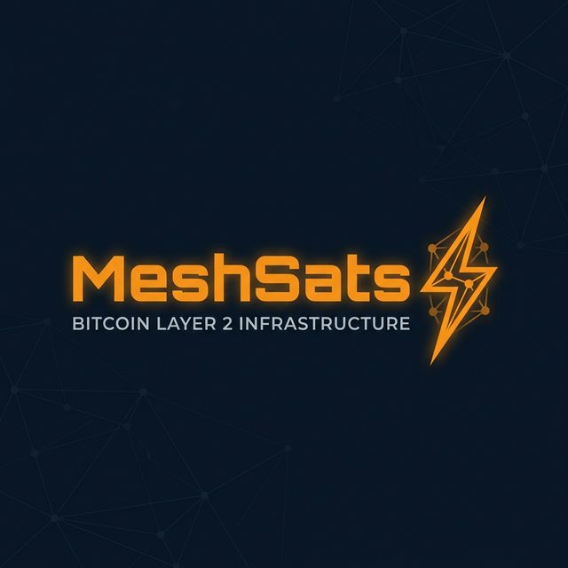

# MeshSats: Offline-First Bitcoin Infrastructure


[](https://bethelclement.github.io/MeshSats/)
> **World Wide Web:** [meshsats.btc](https://bethelclement.github.io/MeshSats/) (Live via GitHub Pages)

MeshSats is a sovereign, offline-first Bitcoin settlement protocol designed for the African market. It bridges the connectivity gap by allowing merchants to capture signed payment intents offline and settle them via the Lightning Network once a mesh node reaches a backbone gateway.

## 🚀 Ultimate Expert Stack (.btc)
MeshSats is a multi-language powerhouse, utilizing the specific strengths of the top Bitcoin-layer languages:

- **Go (Golang):** High-performance infrastructure for Lightning Network settlement (`backend/`).
- **Rust:** Secure protocol suite for BIP-340 Schnorr and DLC signatures (`protocols/`).
- **Python:** Expert-level blockchain analysis and liquidity modeling (`tools/`).
- **JavaScript (React):** Ultra-robust, zero-dependency interface for Safari compatibility (`frontend/`).
- **Clarity (Stacks):** Smart contracts for trust-minimized, Bitcoin-anchored logic (`contracts/`).

- **Offline-to-Online Bridge:** Securely capture payments in zero-connectivity environments.
- **Lightning Native:** Instant settlement via LN channels.
- **Expert Engineering:** Built with native support for PSBT, Schnorr, and LDK/BDK patterns.

### Premium Stack Implementation
This repository demonstrates an industry-leading approach to offline-first Bitcoin infrastructure, utilizing the best-of-breed languages for each layer.

---

## The Problem: Connectivity is the Barrier to Inclusion

In many African markets, rural communities, and urban trade hubs, internet connectivity is inconsistent, expensive, or non-existent. Traditional payment systems and even modern "lite" wallets often fail when the 3G signal drops, stalling trade and excluding millions from the digital economy.

**MeshSats solves this by treating offline as the default state, not an error.**

## What MeshSats Is

MeshSats is not another wallet app. It is **reusable financial infrastructure**. We provide the APIs, documentation, and logic to:
1.  **Capture Intent**: Initiate payments or payouts offline using signed transaction requests.
2.  **Generate Local Proofs**: Issue claim tokens or vouchers that act as temporary local settlement.
3.  **Sync & Reconcile**: Securely settle transactions to the Bitcoin and Lightning networks when connectivity returns.
4.  **Manage Risk**: Implement transaction caps, agent float controls, and audit trails tailored for local commerce.

## Core Infrastructure Pillars

-   **Bitcoin as the Settlement Layer**: Final reconciliation and long-term value storage.
-   **Lightning for Speed**: Fast, low-cost settlement for small-to-medium transactions once synced.
-   **Offline Intent Capture**: Cryptographically signed payment requests that can be shared via QR, local mesh, or SMS-fallback.
-   **Merchant & Agent Tooling**: Infrastructure for local commerce "anchors" who facilitate payouts and collections.

## Use Cases for African Realities

-   **Market Vendor Payments**: Vendors accept "payment intents" from customers, which settle once the vendor syncs at the end of the day.
-   **Agent Network Collections**: Local agents collect payments for utilities or community fees offline, syncing progress periodically.
-   **Waste & Recycling Rewards**: Collectors earn "claim tokens" for plastic/waste drops, which can be redeemed for Sats at a hub.
-   **Community Stipends**: Reliable disbursement of local program funds in remote villages.

## Honest Trust & Risk Model

We do not claim impossible "trustless offline Bitcoin." MeshSats is built on practical design patterns:
-   **Delayed Settlement**: Transactions are queued and settled once online.
-   **Signed Intents**: Prevents spoofing, but requires reconciliation to prevent double-claims.
-   **Controlled Float**: Agents operate within pre-funded liquidity limits to mitigate risk.
-   **Transactional Caps**: Built-in limits for offline-initiated flows.

[Read more in our Risk and Trust Model](docs/risk_and_trust_model.md)

## Repository Structure

```text
├── docs/               # Detailed architecture, use cases, and risk models
├── backend/            # Sync engine and Lightning integration layer (Go)
├── protocols/          # Cryptographic protocol suite (Rust)
├── tools/              # Infrastructure analysis & liquidity tools (Python)
├── contracts/          # Bitcoin-anchored settlement logic (Clarity)
├── frontend/           # Merchant & Agent dashboard (React/JS)
├── assets/             # Branding and diagrams
└── .github/            # Project governance and deployment
```

## Roadmap

-   **Phase 1**: Infrastructure specifications and core architecture (Current)
-   **Phase 2**: Prototype for Offline Intent & Voucher generation
-   **Phase 3**: Sync & Reconciliation engine (Alpha)
-   **Phase 4**: Lightning settlement service integration
-   **Phase 5**: Pilot programs in African merchant environments

## Contributing

We are building in public and welcome contributors who share our vision for Bitcoin-powered financial inclusion. See [CONTRIBUTING.md](CONTRIBUTING.md) to get started.

---

**Built with 🧡 for the Bitcoin ecosystem.**
