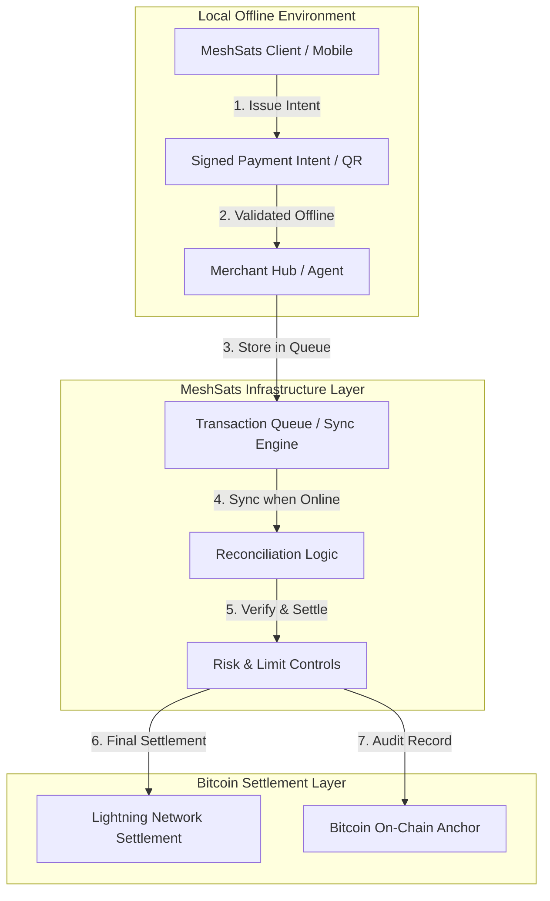

# MeshSats Technical Architecture

MeshSats is designed as a modular, offline-first infrastructure. It decouples the **intent to pay** from the **final network settlement**, allowing commerce to proceed in zero-connectivity environments.

## System Overview

The following diagram illustrates the high-level flow from a local merchant/client to the final Bitcoin/Lightning settlement.

## Core Components

### 1. MeshSats Client (Mobile/Web)
A lightweight client responsible for:
- Generating cryptographically signed **Payment Intents**.
- Storing local transaction history.
- Communicating via offline protocols (QR, Bluetooth, or SMS-fallback).

### 2. Merchant / Agent Hub
The "Local Anchor" in the community:
- Validates the Payment Intent signature.
- Checks local risk rules (e.g., transaction limits).
- Provides "Local Proof of Receipt" to the customer.
- Manages the local queue of pending transactions.

### 3. Sync & Reconciliation Engine
The bridge to the Bitcoin network:
- **Batching**: Groups multiple offline intents for efficient settlement.
- **Verification**: Cross-references intents with pre-funded agent liquidity.
- **Conflict Resolution**: Handles edge cases such as delayed sync or double-claims.

### 4. Lightning Settlement Integration
The primary settlement rail:
- Integrates with BOLT11/BOLT12 flows.
- Uses Lightning for fast, low-cost reconciliation of small-to-medium payments.
- Supports interoperability with existing Lightning wallets for final settlement.

## Offline Flow: The Protocol

1.  **Creation**: User creates an intent offline (Signed message: `[Amount, Recipient, Timestamp, Nonce, Sig]`).
2.  **Exchange**: Intent is shared via QR or local mesh to the Merchant.
3.  **Local Validation**: Merchant verifies the signature and local limits.
4.  **Local Settlement**: Merchant provides goods/services; transaction is marked "Pending-Offline".
5.  **Synchronization**: Once the Merchant/Agent reaches connectivity, the queue is pushed to the Sync Engine.
6.  **Network Settlement**: Sync Engine initiates a Lightning payout to the Merchant's wallet, settling the pending ledger.

## Technical Alignment

MeshSats sits firmly on the Bitcoin stack:
-   **Security**: Leveraging Bitcoin's cryptographic primitives for offline intent signing.
-   **Scale**: Offloading high-frequency local commerce to an offline-first layer, settling via Lightning.
-   **Sovereignty**: Designed for non-custodial or semi-custodial agent models where users control their keys.

---
*Status: Architecture active development. Mock implementations available in `/prototype`.*
